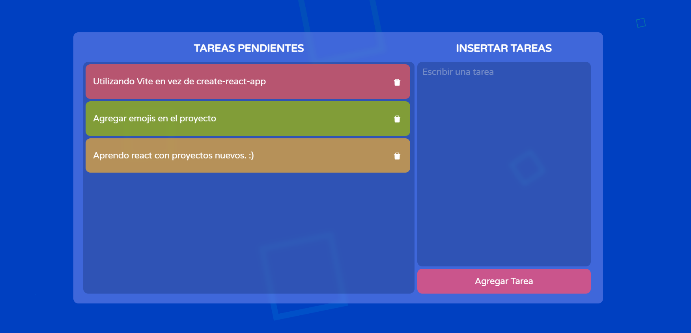

  

<h1 align="center">
  Tareas Moppy
</h1>

 
Este proyecto está creado con React utilizando <a href="https://vitejs.dev/">Vite</a> como empaquetador de archivos.

  

    &#128073; My youtube channel &#127909;
    <a href="https://www.youtube.com/c/angelox2Patrick" target="_blank">angelo x2</a>

    &#128073; Página de facebook &#128153;
    <a href="https://www.facebook.com/Programador347-101320832263307" target="_blank">programador347</a>

